Make a fortune by trading *48* different stocks on *4* [stock exchanges](https://en.wikipedia.org/wiki/Stock_exchange). Up to *four traders* can take part in this [hotseat](https://en.wikipedia.org/wiki/Hotseat_(multiplayer_mode)) game. You have the *edge* over other market participants based on:
* **Insider information:** Look on the economic memos *("newspaper")* that hint at future price movements.
* **Inter-exchange arbitrage:** While there are *40* local stocks, there are also *8* global stocks are listed on each stock exchange. The catch is that their price movements are not correlated. Traveling between stock exchanges ends your turn and costs *$100* but the arbitrage gains might outweigh these costs.
* **Instant market access:** You directly buy or sell stocks based on current market prices without affecting them.

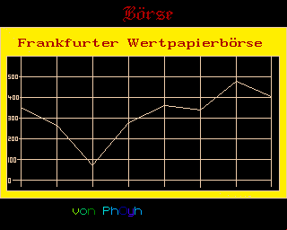

The game language is *German* - but you only need to know some key words in order to play it.

# How to Use

Put the repository into a mounted directory of an *emulated* [Amiga 500](https://en.wikipedia.org/wiki/Amiga_500) and run the script from the shell (you can skip the first line if you do not want to watch the intro):
```
execute Intro
execute Bourse
```

You can also start using the workbench (`info`-files provided).

The game is completely written in [AmigaBASIC](https://en.wikipedia.org/wiki/Amiga_Basic). Its [ASCII](https://en.wikipedia.org/wiki/ASCII) source codes in `src` can also be run from the [IDE](https://en.wikipedia.org/wiki/Integrated_development_environment).

# Trivia

* *Desk:* The image did not find its way into the game due to missing technical know-how (how to load IFF from basic?). This was only solved later, e.g., in [Tennis Manager](https://github.com/phoyh/tennis-manager).
* *Protected source:* The source code of the production version has been lost in time. Only its [encrypted AmigaBASIC program](https://www.reddit.com/r/amiga/comments/15kc19y/decompiler_for_amigabasic/) is available but useless in this repository, as all relative paths cannot be adapted. Hence, an earlier pre-production version for which the source code is still available has been productized again. There are only minor sacrifices if compared to the original production version: There are no player-related time series, some menus are not beautified.
* *Hi-res:* The game uses [interlaced resolution](https://en.wikipedia.org/wiki/Interlaced_video) to maximize the amount of information that can be conveyed. However, this leads to [eye strain](https://en.wikipedia.org/wiki/Eye_strain) on real hardware - fortunately, there will be emulators in the future.
* *Diskfont library:* The only [OS](https://en.wikipedia.org/wiki/Operating_system) routine for which relative paths do not work. Hence, it is put into the `src` folders.
* *Inspiration:* There is a much more basic (but also realistic) [game](https://www.emurom.net/us/emulation/commodore-64-roms/detail-69104-b%C3%B6rsenspiel.das.html) on the [C64](https://en.wikipedia.org/wiki/Commodore_64) from which I drew some inspiration.

# Gallery

| 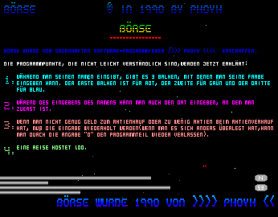 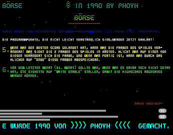 |
| :--: |
| Combined intro and manual |

| 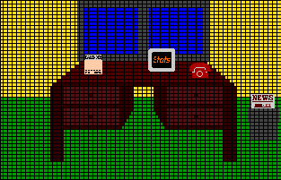 |
| :--: |
| Desk as monthly player menu |

| 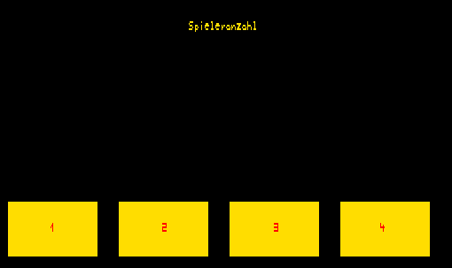 | 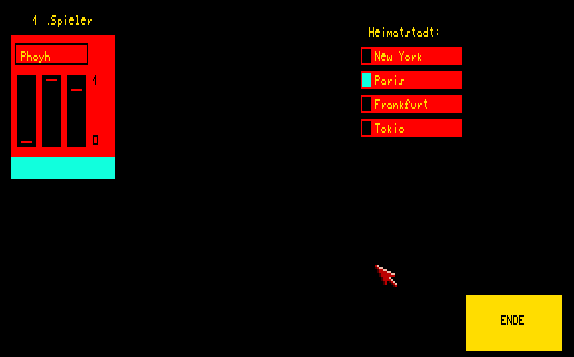 |
| :--: | :--: |
| Up to four players are supported | State your name, favorite color ([RGB](https://en.wikipedia.org/wiki/RGB_color_space)), <br> and your home stock exchange |

| 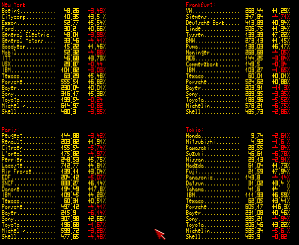 |
| :--: |
| A total of *48* stocks are listed on the *4* stock markets. *8* of the them are available everywhere. |

| 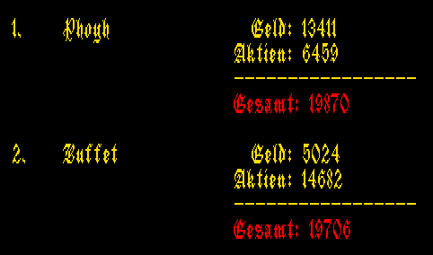 |
| :--: |
| The players assets consist of money and the local valuation of their stock holdings. |

| 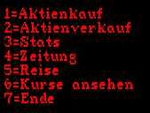 |
| :--: |
| The actions that are available in each turn. <br> Only option *5* and *7* will immediately lead to the end of the turn. |

| 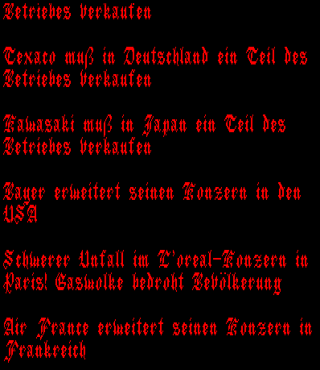 |
| :--: |
| Make use your insider information. |

| 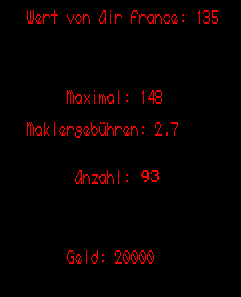 |
| :--: |
| When buying shares, the maximum amount hints at your buying power. |

| 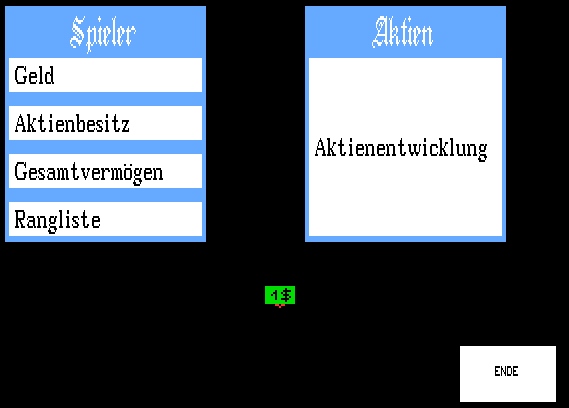 | 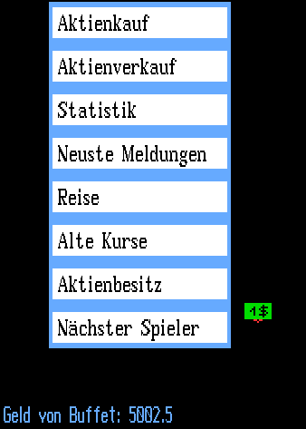 |
| :--: | :--: |
| The original production version included time series of the player's assets. | The monthly menu in that version. <br> *The game's mouse pointer is found [here](devs/system-configuration).* |
